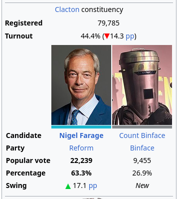
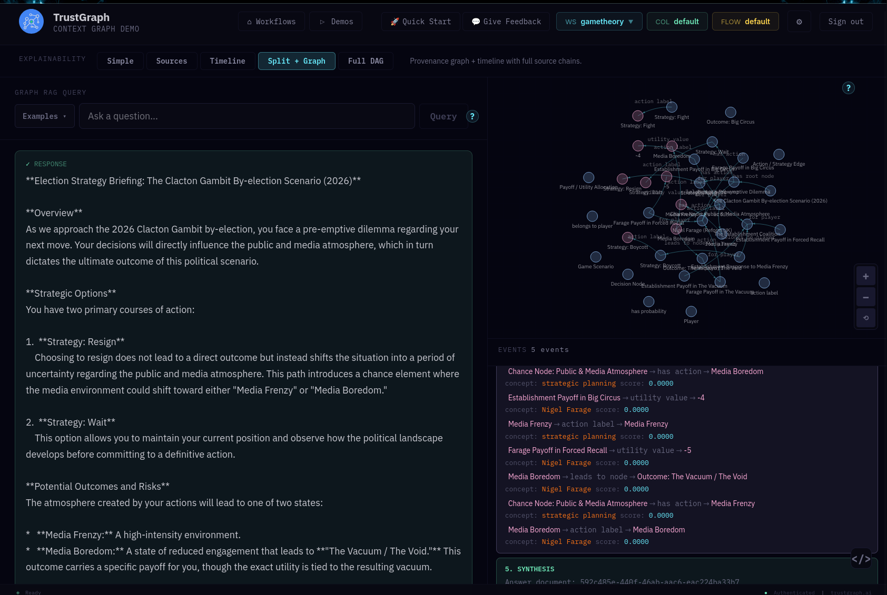
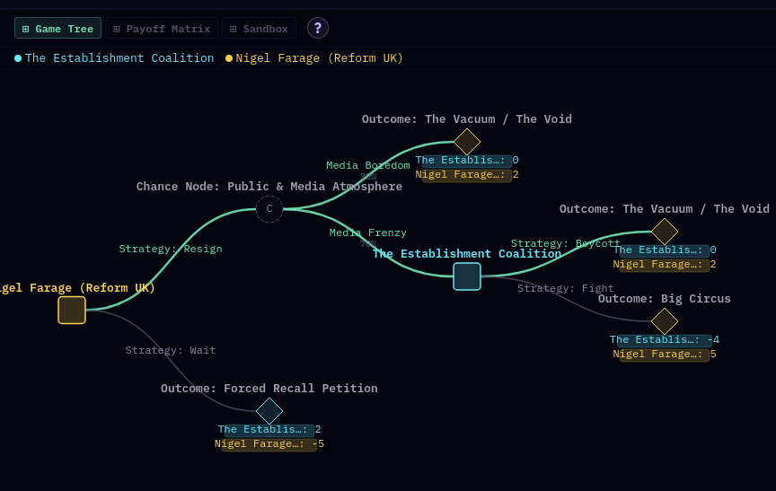
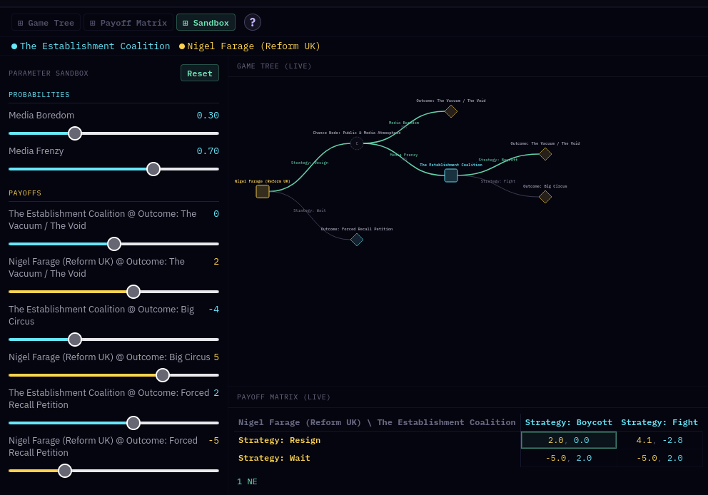

# Game Theory

Explore political strategy through the lens of formal game theory. This
dataset models a real-world political scenario — the Clacton by-election of
2026 in the UK — as a sequential game with decision nodes, chance events, and
quantified payoffs for each player.

If you're not familiar with the background, you can read about it
[here](https://en.wikipedia.org/wiki/2026_Clacton_by-election).

This is a somewhat unusual, light-hearted attempt to translate the
unpredictable real-world drama of UK politics into formal decision trees and
strategic payoffs using a story which may be familiar to many readers.  The
game theory analysis we use here could have potential for complex scenarios,
strategic planning, or planning for civil resilience and emergency response.

## What is the data

The knowledge graph models a sequential two-player game: Nigel Farage
(Reform UK) vs. the Establishment Coalition (Labour, Conservative,
Lib Dems, Greens). The game tree captures Farage's opening decision
(resign or wait), a chance node representing media reaction (frenzy or
boredom, with assigned probabilities), and the Coalition's counter-move
(fight or boycott). Three terminal outcomes carry numeric payoffs for
each player: Big Circus (+5/-4), The Vacuum (+2/0), and Forced Recall
Petition (-5/+2).

The dataset includes the full ontology (players, decision nodes, chance
nodes, actions, outcomes, payoffs) and a set of queries spanning
structured graph traversal, interpretive Graph RAG analysis, and
multi-step agent reasoning.

This ontology is designed to be used with the Game Theory application.
This application could be used to view other game scenarios providing
that they conform to the existing ontology.

The data was generated from news articles and formed into a knowledge graph
which is ready to load, so there is no expensive data ingest step needed
to load the dataset.  The ontology could be used to prepare other
scenarios.

After loading, The data is loaded into the `gametheory` workspace -
select that in the workspace in the header bar selector, top right.

## What you can explore

- **Knowledge graph** — browse the knowledge graph to see how the
  scenario is structured: players, decision points, chance events,
  and outcomes with their payoff values.

- **Ontology** — explore the ontology in **Ontology Management** to
  understand the classes and relationships that underpin the game model.

- **Game Theory app** — on the demos tab, present the knowledge graph
  as a standard game theory decision tree with player colour coding
  and payoff annotations.

- **Sandbox** — use the sandbox tab in the Game Theory app to adjust
  probabilities and payoff values with sliders and see how alternative
  parameters shift the strategic balance and Nash equilibria.

- **Strategic analysis** — use Graph RAG or agent retrieval to ask
  questions, prepare analysis, or write briefings and blog posts.

## Example GraphRAG query

Using this prompt:

> Write detailed election strategy briefing for Nigel Farage. Keep it
> strategic, normal language, avoid game theory technicalities to a
> minimum.

The Graph RAG agent draws on the knowledge graph to produce a
practical strategy briefing, referencing the decision tree, chance
events, and payoff structure without requiring the user to understand
formal game theory.  The GraphRAG workflow uses the knowledge graph to
answer the question, and you also get some insights RHS which provide
an explainable insight into how the GraphRAG process works.

## Interactive game tree

The game tree plugin visualises the full decision structure: player
nodes, chance branches with probabilities, strategic choices, and
terminal outcomes with payoffs for each side. Trace any path from
Farage's opening decision through to its consequences.

## Sandbox

Adjust probabilities and payoff values with sliders and watch the
game tree and payoff matrix update in real time. The sandbox computes
Nash equilibria automatically, so you can explore how changes in
media reaction probabilities or outcome utilities shift the
strategic balance between players.

## What kinds of questions work well

- "What is Farage's best strategy, and why?"
- "Does either player have a dominant strategy?"
- "How does the probability of media frenzy affect the expected outcome?"
- "Compare the payoffs across all terminal outcomes"
- "Write an agenda for Nigel Farage's strategy review meeting to determine
   next steps"
- "What are the credible threats available to each side?"

## Features

- Knowledge graph queries for structured game tree data
- Graph RAG for interpretive, essay-style strategic analysis
- Agent queries for multi-step game-theoretic reasoning
- Interactive game tree visualisation with player colour coding
- Sandbox with adjustable parameters, live payoff matrix, and Nash
  equilibrium computation
- Full game tree with 2 players, 6 nodes, and 3 terminal outcomes
