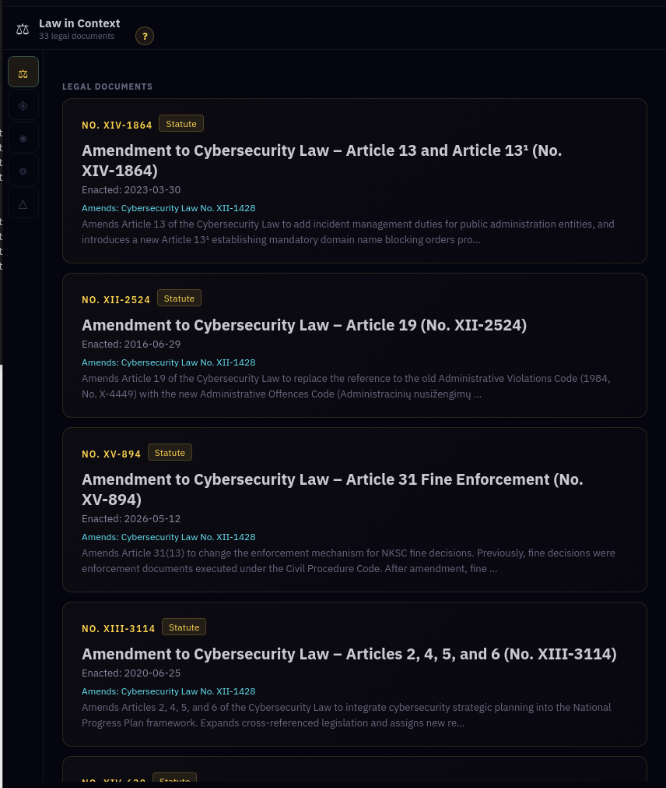
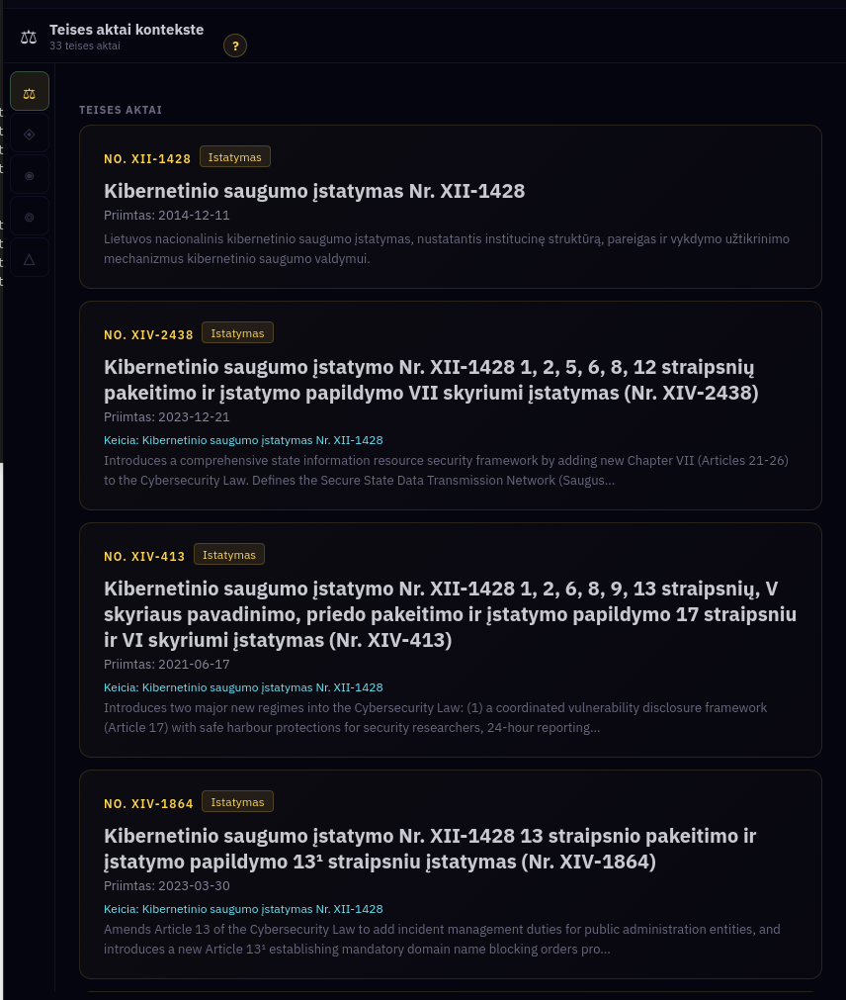
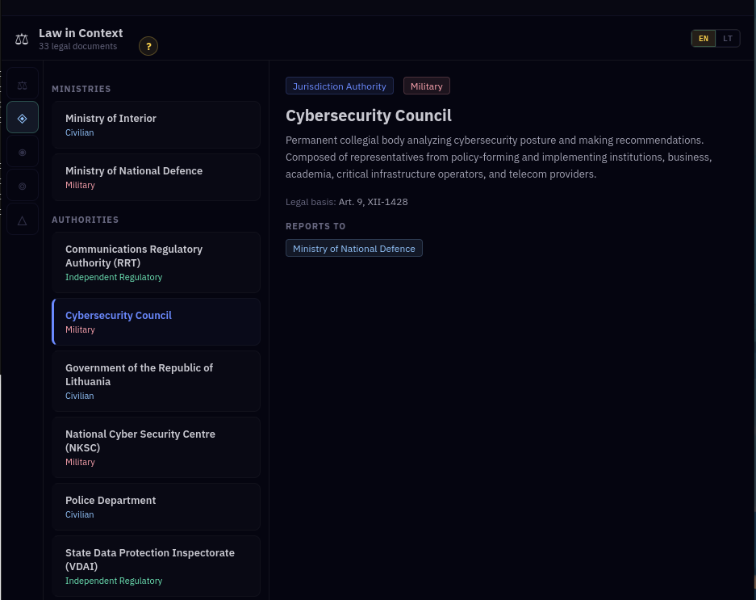
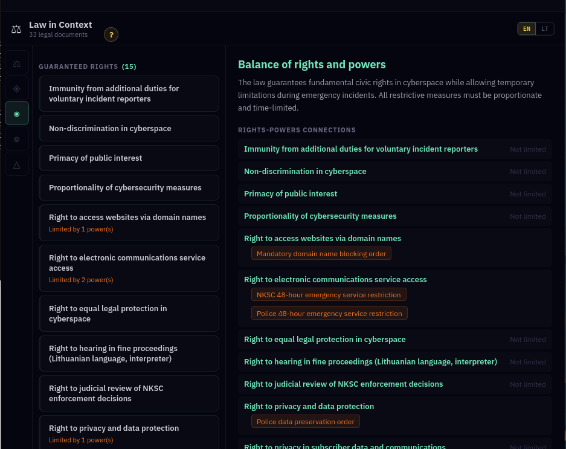
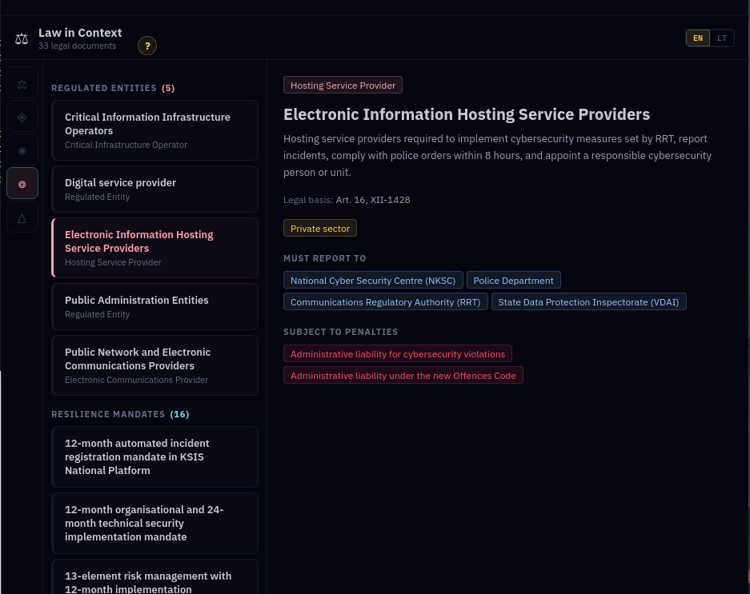
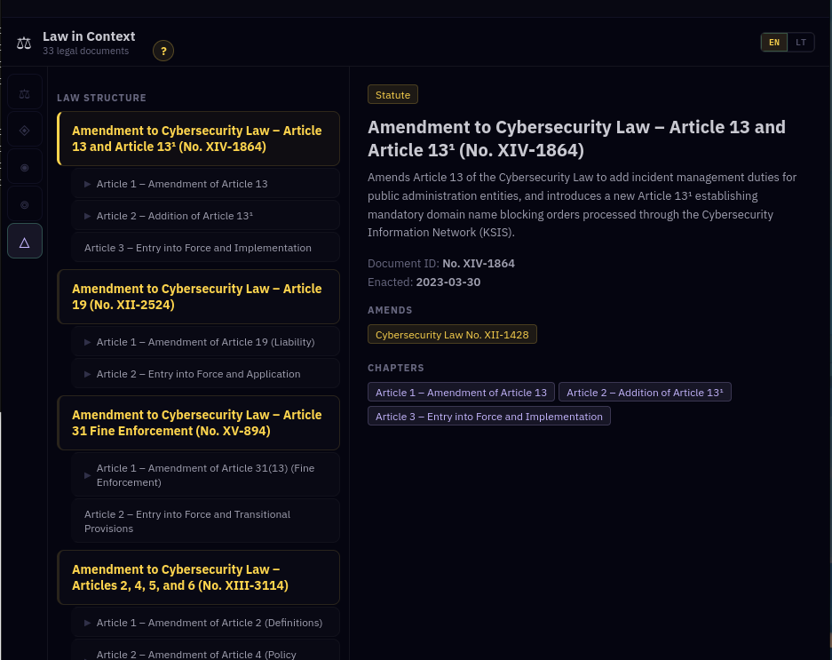
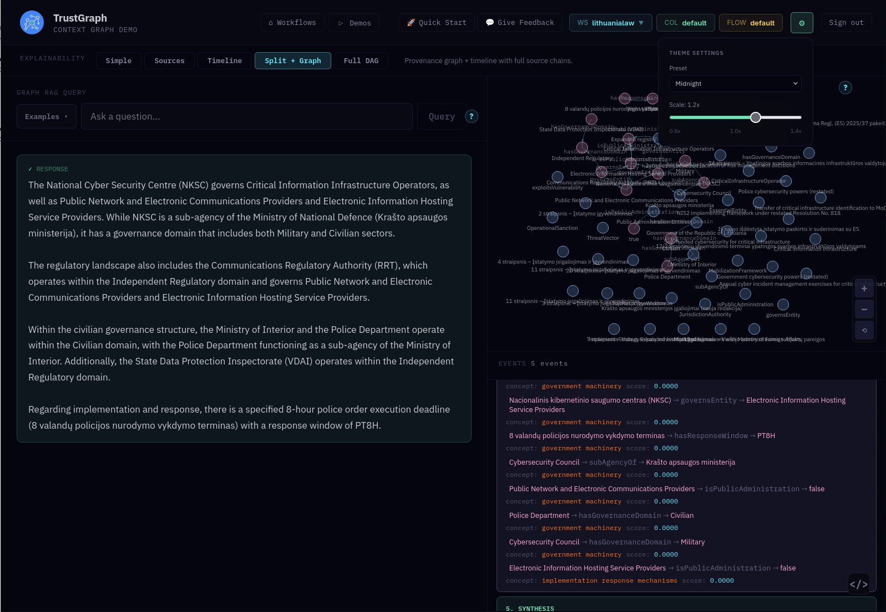

# Lithuanian Law

Navigate Lithuania's legislative framework for cybersecurity, national
defence, and critical infrastructure protection. This dataset contains
33 legislative documents spanning 2014 to 2026, structured as a
knowledge graph that connects statutes, regulatory bodies, regulated
entities, threat actors, and enforcement mechanisms.

## What is the data

The knowledge graph models Lithuania's cybersecurity legislation as
interconnected entities: enacted statutes and their amendments, regulatory
institutions with jurisdictions, categories of regulated entities with
compliance obligations, identified threat actors and vectors, enforcement
penalties, resilience mandates, and guaranteed civic rights.

The knowledge graph was extracted by processing law documents published
publicly. This dataset illustrates how the connections between documents
and entities can be discovered by using an ontology to guide extraction,
so that structured linkage is in place. The demo application shows how
complex structures — such as the balance between citizens' rights and
state powers — can be automatically extracted from document sets and
made available in UX.

The extracted data is ready to load with no expensive ingest step
needed. The ontology is designed to support both structured queries
and natural language analysis across the full legislative corpus.

After loading, the data is available in the `lithuanialaw` workspace —
select it in the workspace selector in the header bar, top right.

## What you can explore

- **Law in Context app** — on the demos tab, browse the legislative
  framework through multiple lenses: documents, institutions,
  regulated entities, civic rights, and law structure.

- **Knowledge graph** — explore the graph to see how statutes,
  institutions, entities, and threats interconnect.

- **Strategic analysis** — use Graph RAG or agent retrieval to ask
  questions about compliance, governance, threats, or policy evolution.

## Law in Context: documents

The first tab lists statutes, amendments, and government resolutions
with their relationships to the core Cybersecurity Law. See which
articles each amendment modifies and when it was enacted.

The app supports both English and Lithuanian — toggle the EN/LT
switch top right to view the full legislative corpus in its original
language.

## Law in Context: institutions

Explore the institutional governance structure. Ministries and
authorities are listed with their governance domains (civilian,
military, independent regulatory). Select any institution to see its
description, legal basis, and reporting relationships.

## Law in Context: rights and powers

The balance of rights and powers view maps 15 guaranteed civic rights
against the state powers that can limit them. Each right shows whether
it is unrestricted or constrained by specific emergency powers, such
as NKSC 48-hour service restrictions or mandatory domain blocking
orders.

## Law in Context: entities

See how the law affects different types of entity — not just regulated
organisations like critical infrastructure operators and hosting
services, but also government bodies themselves. Each entry shows
reporting obligations, applicable penalties, and resilience mandates.

## Law in Context: law structure

Navigate the hierarchical structure of amendments: chapters, articles,
and clauses. Each document shows its type, document ID, enactment
date, and which statutes it amends.

## Example Graph RAG query

> Describe the Lithuanian laws which protect national critical
> infrastructure and their relationships to government machinery
> response for implementation

Use Graph RAG to ask analytical questions across the full legislative
corpus. The knowledge graph provides the context for detailed,
referenced answers with explainable insights on the right-hand side.

## What kinds of questions work well

- "What are the full powers of the NKSC?"
- "What is the maximum financial penalty exposure by entity type?"
- "How has Lithuania responded to Russian and Belarusian threats in
  legislation?"
- "Walk me through the incident reporting chain — who reports to whom,
  and when?"
- "Where does Lithuanian law exceed EU directive requirements?"
- "What personal risks do executives face under cybersecurity law?"
- "What oversight mechanisms protect against state overreach?"

## Features

- 33 legislative documents modelled as interconnected knowledge graph
  entities
- Law in Context app with views for documents, institutions, regulated
  entities, civic rights, and law structure
- English and Lithuanian language support (EN/LT toggle)
- Comprehensive ontology covering institutions, entities, threats,
  mandates, enforcement, and civic rights
- Standard queries for structured legal data retrieval
- Graph RAG for interpretive legal analysis and policy narratives
- Agent queries for complex investigative reasoning across multiple
  statutes
