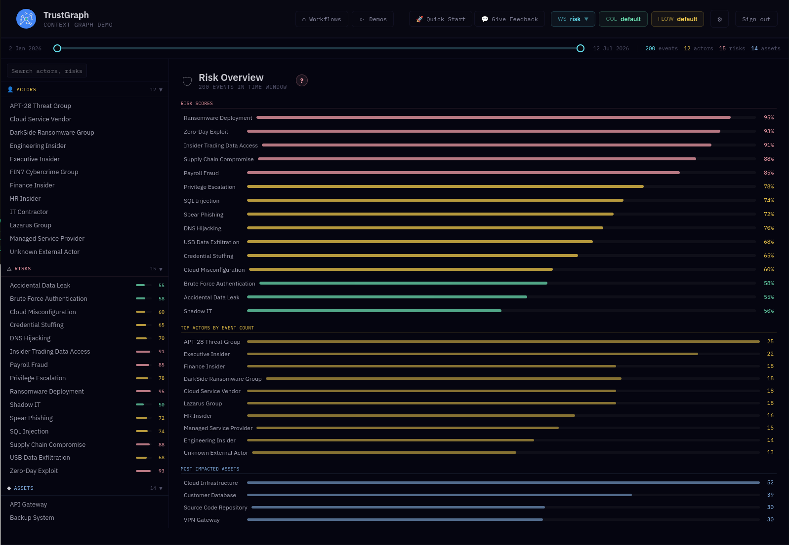
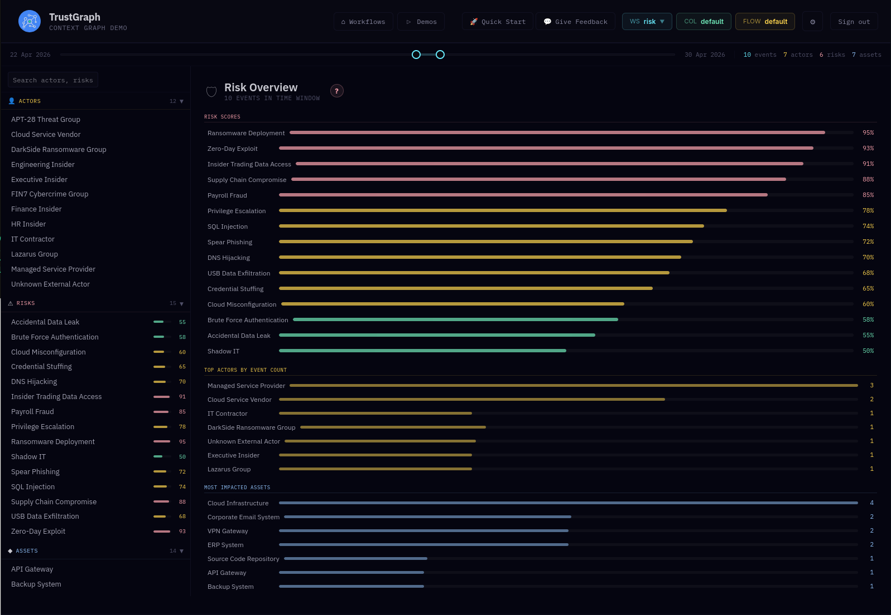
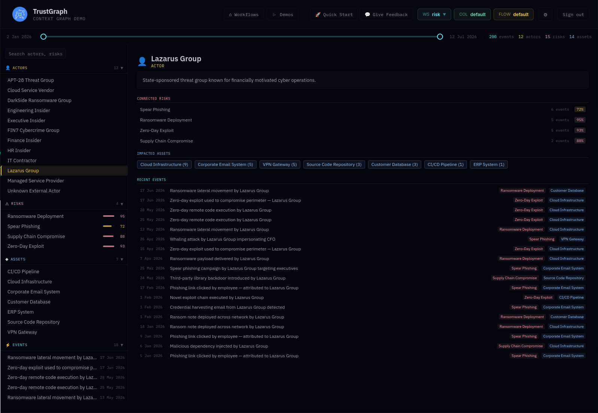
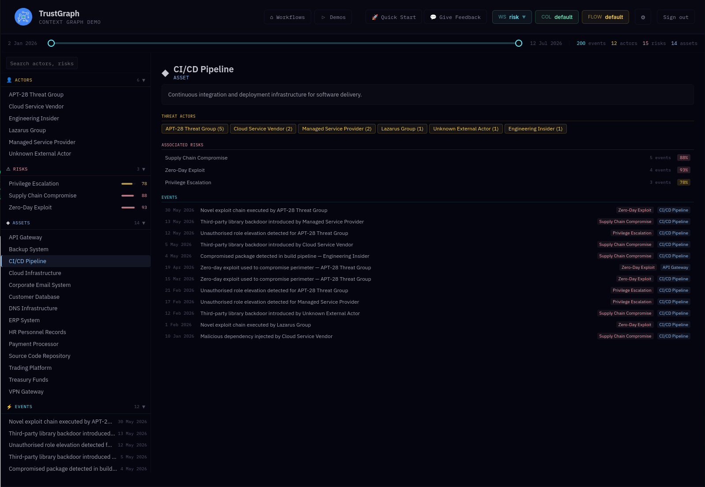

# Risk Management

Monitor and analyse enterprise security incidents across a simulated
organisation. This dataset models 200 risk events spanning threat actors,
attack methods, impacted assets, and incident response workflows with
step-level tracking.

## What is the data

The knowledge graph models an enterprise risk landscape with 12 threat
actors (external APT groups, internal insiders, and third-party vendors),
15 risk categories scored by severity, 14 corporate assets, 200 security
events linking actors to methods and targets, and 297 incident response
processes with step-level completion tracking.

The data is synthetic but realistic, modelling the kind of security
event stream an enterprise SOC would monitor. Events span January
through February 2026 with precise timestamps, supporting time-windowed
analysis.

After loading, the data is available in the `risk` workspace — select
it in the workspace selector in the header bar, top right.

## What you can explore

- **Risk Overview app** — on the demos tab, get a dashboard view of the
  full risk landscape with ranked risk scores, top actors by event
  count, and most impacted assets.

- **Time-windowed analysis** — use the timeline slider to narrow the
  view to specific periods. The dashboard updates dynamically, showing
  how the threat picture changes over time.

- **Actor and asset drill-down** — select any actor or asset from the
  sidebar to see its linked risks, targeted assets (or targeting
  actors), and full event timeline.

- **Knowledge graph** — explore the graph to see how actors, risks,
  assets, and incident response processes connect.

- **Strategic analysis** — use Graph RAG or agent retrieval to ask
  investigative questions, compare threat categories, or identify
  gaps in incident response.

## Risk Overview

The dashboard shows the full event stream ranked by risk score, actor
activity, and asset impact. Actors, risks, and assets are listed in
the left sidebar for quick navigation.

Use the timeline slider to narrow the time window. The dashboard
filters to show only events in the selected range — here narrowed
to 10 events in a one-week window, revealing which actors and assets
were active during that period.

## Actor detail

Select an actor to see their profile: linked risk types, targeted
assets, and a chronological event log. Here the Lazarus Group is
selected, showing its associated risks and full event history.

## Asset detail

Select an asset to see which actors have targeted it and the full
event timeline. Here the CI/CD Pipeline is selected, showing the
threat actors involved and associated events colour-coded by risk
type.

## What kinds of questions work well

- "Which threat actor poses the highest risk based on severity and frequency?"
- "What is our most vulnerable asset?"
- "Show me all high-risk events with no incident response process"
- "Compare insider threats vs external APT activity"
- "What would be the blast radius of a ransomware attack?"
- "Where are the bottlenecks in our incident response?"
- "Which assets has APT-28 targeted?"

## Features

- Risk Overview dashboard with ranked risk scores, actor activity,
  and asset impact
- Interactive timeline slider for time-windowed analysis
- Actor and asset drill-down views with event histories
- Knowledge graph queries for structured event and process data
- Graph RAG for analytical assessments and risk narratives
- Agent queries for multi-step investigative reasoning
- Event-centric data model linking actors, risks, assets, and responses
