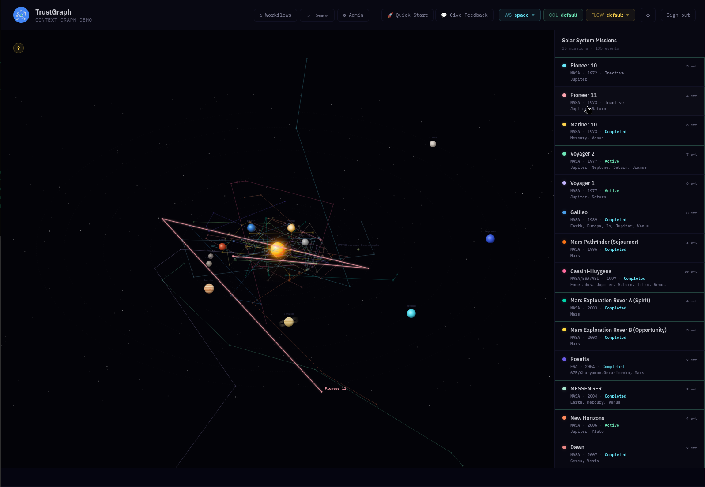
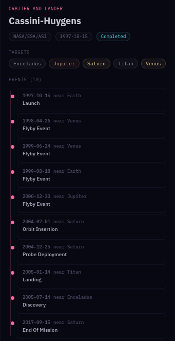
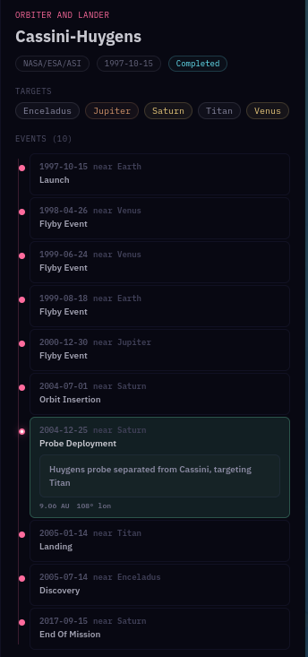
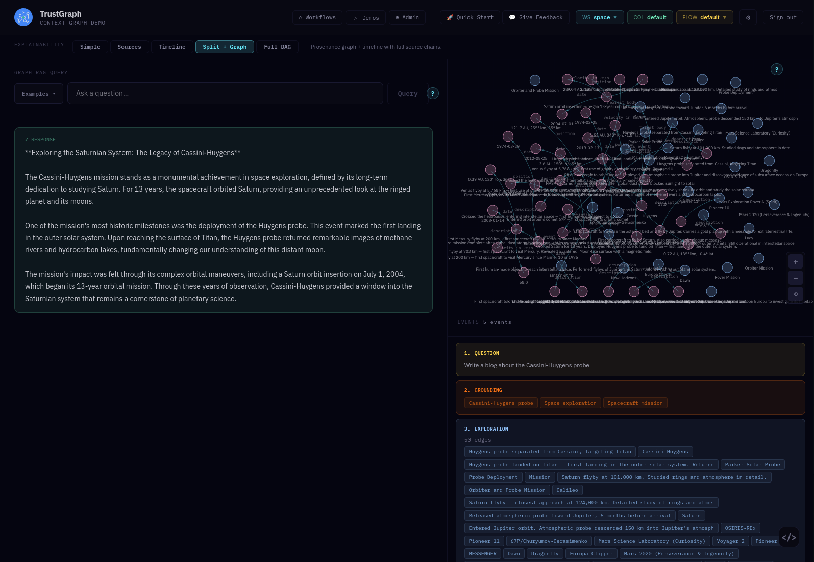

# Space Exploration

Explore the solar system through mission data and a comprehensive star
catalogue. This dataset combines a knowledge graph of space missions and
celestial bodies with a structured database of nearly 120,000 stars,
demonstrating both semantic knowledge queries and structured data search
in a single workspace.

## What is the data

This dataset has two parts: a knowledge graph and a structured dataset.

The **knowledge graph** covers space missions, extracted from solar
mission documentation such as Wikipedia articles. Celestial bodies —
all 8 planets, dwarf planets, moons, asteroids, and a comet — carry
orbital and physical data. Missions include Voyager 1 and 2, Pioneer,
Cassini-Huygens, Mars rovers, Rosetta, and others, each with complete
event histories from launch through flybys, orbit insertions, landings,
discoveries, and current status.

The **structured dataset** is tabular data stored as rows — TrustGraph
includes a row store mechanism for this kind of data. The star
catalogue is extracted from the HYG database (v4.2) and contains
119,627 stars, each with a rich set of properties: catalogue
identifiers (Hipparcos, Henry Draper, Gliese, Bayer, Flamsteed),
celestial coordinates (right ascension, declination), distance in
parsecs, proper motion and radial velocity, apparent magnitude,
spectral type (the stellar classification from O through M),
colour index, luminosity in solar luminosities, constellation
membership, and variable star designations with magnitude ranges.

After loading, the data is available in the `space` workspace —
select it in the workspace selector in the header bar, top right.

## What you can explore

- **Solar System app** — on the demos tab, the Solar System explorer
  accesses the mission knowledge graph to visualise trajectories
  across the solar system with an interactive map and mission list.

- **Mission timelines** — select any mission to see its full event
  history. Expand individual events for descriptions and heliocentric
  positions.

- **SPARQL Query** — execute raw SPARQL queries against the knowledge
  graph. The workflow is populated with preset example queries for
  missions, celestial bodies, events, and flybys.

- **GraphQL Query** — execute GraphQL queries against the structured
  star tabular data. Sample queries are included in the preset menu
  for searching by name, constellation, spectral type, distance,
  brightness, and luminosity.

- **Agent** — the agent is configured with tool access to both
  datasets, so it can query solar mission data, star data, or combine
  results from both in a single response.

- **Graph RAG** — ask natural language questions and get answers
  grounded in the mission knowledge graph.

## Solar system visualisation

The Solar System app shows mission trajectories overlaid on the solar
system. The mission list on the right provides quick access to each
mission's details — click any mission to see its timeline.

## Mission timeline

Select a mission to see its full chronological event history. Here
the Cassini-Huygens mission shows all 10 events from its 1997 launch
through Venus and Jupiter flybys, Saturn orbit insertion, the Huygens
probe deployment and Titan landing, the Enceladus discovery, through
to end of mission in 2017.

Expand any event to see its description and heliocentric position
data.

## Example Graph RAG query

> Write a blog about the Cassini-Huygens probe

Graph RAG draws on the mission knowledge graph to produce detailed
content about any mission, referencing specific events, dates, targets,
and discoveries. The knowledge graph context and explainability
insights are shown on the right-hand side.

## What kinds of questions work well

- "What missions have done a flyby of Jupiter?"
- "Compare Voyager 1 and Voyager 2 — which planets did each visit?"
- "What is the furthest distance from the Sun any spacecraft has
  reached?"
- "Write a blog about the Cassini-Huygens probe"
- "Show me the brightest stars in Orion"
- "Find stars within 5 parsecs of the Sun"
- "What spectral type is Sirius?"
- "Which stars have luminosity greater than 10,000 Suns?"

## Features

- Solar System app with interactive mission trajectory visualisation
- Mission timelines with expandable event details and positions
- Knowledge graph for mission data with Graph RAG and agent query
  support
- Structured data search across 119,627 stars with query and vector
  indexing
- Two workflow modes: full hybrid access or structured-only star queries
- Natural language tools for both mission knowledge and star catalogue
